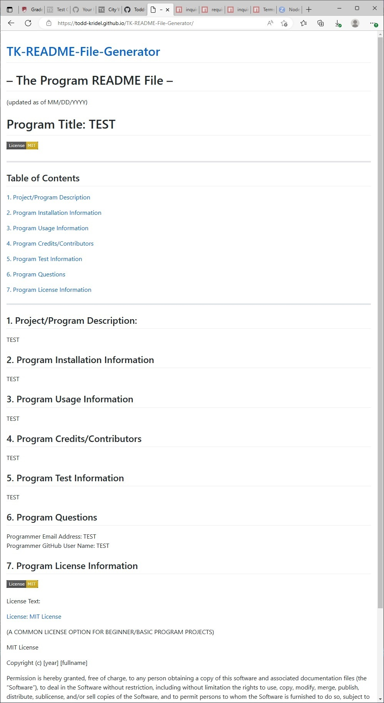

# ——— The Program README File ———
(updated as of 12/19/2022)

# Program Title: Bootcamp Module 9 Challenge Assignment -- a README File Generator Program per prompting to the user

--------------------------------

## Table of Contents

[1. Project/Program Description](#1-ProjectProgram-Description)

[2. Program Installation Information](#2-Program-Installation-Information)

[3. Program Usage Information](#3-Program-Usage-Information)

[4. Program Credits/Contributors](#4-Program-CreditsContributors)

[5. Program Test Information](#5-Program-Test-Information)

[6. Program Questions](#6-Program-Questions)

[7. Program License Information](#7-Program-License-Information)

--------------------------------

## 1. Project/Program Description:

This current Module Challenge 9 assignment -- an interactive console command-line-based README file generator program -- provided a good mechanism for learning introductory server-side JavaScript programming and for dynamic file-compilation processing and for system-planning concepts and practices and perspectives that were not involving browser webpage connection or functionality or design. A large portion and effort of my personal assignment was for the mental process of switching gears (conceptually) into the non-webpage-system aspect and requirements of the assignment program. The program also involved and gave practice regarding concepts of importing and interfacing with (meeting requirements of) other program modules that work in conjunction with our own programs in a utility way...including the modularization concept of creating and exporting and importing our own utility code. Lastly the assignment provided practice at the concepts of project presentation through demonstration video generation for a project that does not really have a presentable user-interface webpage; and the assignment provided an opportunity to further think about the concerns of selecting and applying an appropriate open-source software usage license to a posted/published GitHub repository program that is intended for public access/consumption.

----

The objectives -- user story and acceptance criteria items -- of the assignment were as follows:

[ User Story ]

AS A developer...I WANT a README generator...SO THAT I can quickly create a professional 
README for a new project.

[ Acceptance Criteria ]

GIVEN a command-line application that accepts user input...

* WHEN I am prompted for information about my application repository...THEN a high-quality, 
professional README.md is generated with the title of my project and sections entitled 
Description, Table of Contents, Installation, Usage, License, Contributing, Tests, and 
Questions sections.
* WHEN I enter my project title...THEN this is displayed as the title of the README.
* WHEN I enter a description, installation instructions, usage information, contribution 
guidelines, and test instructions...THEN this information is added to the sections of the 
README entitled Description, Installation, Usage, Contributing, and Tests.
* WHEN I choose a license for my application from a list of options...THEN a badge for that 
license is added near the top of the README and a notice is added to the section of the README 
entitled License that explains which license the application is covered under.
* WHEN I enter my GitHub username...THEN this is added to the section of the README entitled 
Questions, with a link to my GitHub profile.
* WHEN I enter my email address...THEN this is added to the section of the README entitled 
Questions, with instructions on how to reach me with additional questions.
* WHEN I click on the links in the Table of Contents...THEN I am taken to the corresponding 
section of the README.

[ Additional Grading Criteria ]

Also good coding practices and good GitHub/Git repository configuration. Also a usage-demonstration video file (per Google-based Screencastify).

## 2. Program Installation Information

Make sure that you have a GitHub membership and account to be able to view the repository of the assignment webpage system. The published GitHub Pages view of the website should be accessible on the public internet access URL without a need to have a GitHub membership/account.

Have the "node.js" system software installed and have for this program directory a "package.json" file that indicates the required dependencies of the README file generator program:

 "dependencies": {
    "inquirer": "^8.2.4", // Refer to the "inquirer" website.
    "fs": "", // current version; Refer to the "fs" File System modules website.
    "theUtilityFunctions": "1.0.0"
      // a utility JavaScript file that is was programmed with this program and is included in the contained "util" sub-directory
  }

The required supporting utility module files have to be pre-installed to a "node_modules" sub-directory folder of the project directory folder. Refer to the appropriate system company websites and their support documentation.

## 3. Program Usage Information

To use this password generator webpage...

1. Clone the program repository if desired -- "git clone git@github.com:Todd-Kridel/TK-README-File-Generator.git" -- to a desired local-computer working directory.

2. In a command prompt terminal window of the project clone/download directory...enter the command "node index".

3. Respond to the README file content question prompts to provide the information that is necessary to compose the contents of the starting version of the needed new README file. At the end of the prompt session...and assuming that no processing errors occurred...the new README file is created in the current working directory.

4. Navigate to and open the generated README file and add/update additional information as-needed for the progression of the new project program. Notice that the new README file is properly formatted and has an auto-linking "Table of Contents" section; and has a usage license section that automatically displays the official badge/icon of the selected license (if any).

Note: An enhancement component that was desired for the program but was skipped because of lack of time was an implementation/utilization of a GitHub API fetch/response promise function to auto-download the current content text of the selected usage license. For now...for all but 1 of the selectable GitHub-popular licenses...only the URL link of the license text website is provided for manual copying by the user; but the 1 most-common MIT license does have a program function that imports the text version of the license that existed at the time of the programming of this program...but that license text will have to be manually updated/refreshed in the future.

The following picture shows the appearance of an example of a generated README file:

The following files are "webm"-format video (higher resolution) and a "gif"-format video (lower resolution) that show a short demonstration of the usage of the program to generate a starting README file; and then the generated file can be updated in a text editor program and then uploaded/pushed the a GitHub repository. The README file that now is in the project repository (URL at below) is the updated added-to version of the original auto-generated file. Only additional explanation/detail text was added to the file; there was not any new formatting/styling that was implemented.

WEBM VIDEO (perhaps requiring a special video player app/extension association for viewing): 

GIF VIDEO: 

The following URL is for the GitHub Pages published public view of Todd Kridel's Coding Bootcamp Module Challenge 9 assignment...which in this case is only a mirrored HTML version of the README.md Markdown file that was generated from the program for this assignment: "https://todd-kridel.github.io/TK-README-File-Generator". Notice that the hypertext/auto links of the "Table of Contents" section of the HTML version of the file do not function because the links were programmed as Markdown-code (not HTML-code) links; but the section links *do* function in the Markdown viewer view of the README file that is displayed at the root/main level of the project repository "https://github.com/Todd-Kridel/TK-README-File-Generator".

## 4. Program Credits/Contributors
Special credit callout to the Contributors of the starter code of this assignment; by way of the starter code bootcamp-related repository "git@github.com:coding-boot-camp/potential-enigma.git": user @Xandromus (Xandromus Xander Rapstine) and user @gachoi06 (gachoi06 Grace Choi).

## 5. Program Test Information
NONE

## 6. Program Questions
Programmer Email Address: <todd.kridel@gmail.com>   
Programmer GitHub User Name: github.com/Todd-Kridel

## 7. Program License Information

License Text:

[License: MIT License](https://opensource.org/licenses/MIT)

(A COMMON LICENSE OPTION FOR BEGINNER/BASIC PROGRAM PROJECTS)

MIT License

Copyright (c) [year] [fullname]

Permission is hereby granted, free of charge, to any person obtaining a copy
of this software and associated documentation files (the "Software"), to deal
in the Software without restriction, including without limitation the rights
to use, copy, modify, merge, publish, distribute, sublicense, and/or sell
copies of the Software, and to permit persons to whom the Software is
furnished to do so, subject to the following conditions:

The above copyright notice and this permission notice shall be included in all
copies or substantial portions of the Software.

THE SOFTWARE IS PROVIDED "AS IS", WITHOUT WARRANTY OF ANY KIND, EXPRESS OR
IMPLIED, INCLUDING BUT NOT LIMITED TO THE WARRANTIES OF MERCHANTABILITY,
FITNESS FOR A PARTICULAR PURPOSE AND NONINFRINGEMENT. IN NO EVENT SHALL THE
AUTHORS OR COPYRIGHT HOLDERS BE LIABLE FOR ANY CLAIM, DAMAGES OR OTHER
LIABILITY, WHETHER IN AN ACTION OF CONTRACT, TORT OR OTHERWISE, ARISING FROM,
OUT OF OR IN CONNECTION WITH THE SOFTWARE OR THE USE OR OTHER DEALINGS IN THE
SOFTWARE.

For more information (and updated text), please refer to https://opensource.org/licenses/MIT.
